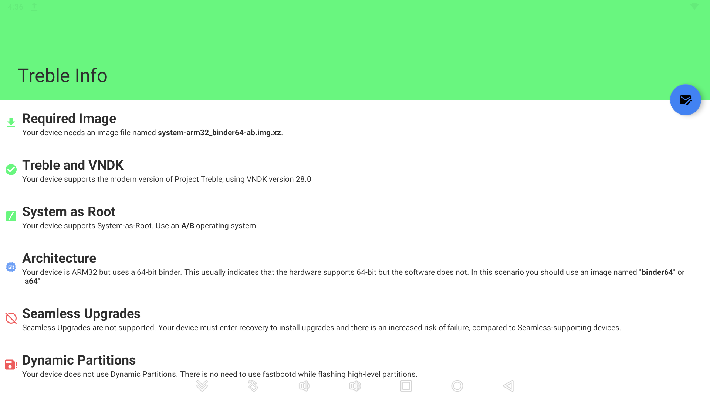

# TWRP Recovery Device Tree & Kernel
* C-Force C-SMART CF011S Smart Screen

## NOTE: Still a WIP!(Work In Progress)

## Device Specifications

| Specifications          | C-Force C-Smart CF011S Smart Screen                                 |
| ----------------------- | :-----------------------------------------------------------------: |
| Codename                | SMART-SCREEN                                                        |
| Chipset / SoC           | Sunxi(sun50iw6p1) Allwinner H6 (28 nm)                              |
| CPU                     | 4 x Cortex-A53 rev.                                                 |
| GPU                     | Mali-T720 MP2 @ 600Mhz                                              |
| Memory                  | 2 GB DDR4                                                           |
| Shipped Android version | 9.0 (Android Pie)                                                   |
| Internal Storage        | 16GB eMMc                                                           |
| MicroSD                 | Up to 64 GB                                                         |
| USB                     | 1x USB-A, 2x USB-C (1x USB-C Reserved for Power)                    |
| Battery                 | Wall Plug                                                           |
| Dimensions              | 14.57 x 8.66 x 0.24 inches                                          |
| Display                 | 15.6 inch 1080p IPS, 1920 x 1080 pixels, 16:9 Aspect Ratio          |
| Treble Supported        | Yes                                                                 |
| VNDK Version            | 28.0                                                                |

## Treble Info:



### Links:

[Linux Sunxi Wiki](https://linux-sunxi.org/H6)

[CForce Link](https://cforcedesign.com/collections/frontpage/products/c-smart-the-world-s-first-portable-android-touch-display)

[Amazon Link](https://www.amazon.com/CF011S-Portable-Assistant-15-6inch-Compatible/dp/B08HQRNCDV)

## Copyright

```
 /*
 *  Copyright (C) 2013-22 The TWRP
 *
 * This program is free software: you can redistribute it and/or modify
 * it under the terms of the GNU General Public License as published by
 * the Free Software Foundation, either version 3 of the License, or
 * (at your option) any later version.
 *
 * This program is distributed in the hope that it will be useful,
 * but WITHOUT ANY WARRANTY; without even the implied warranty of
 * MERCHANTABILITY or FITNESS FOR A PARTICULAR PURPOSE.  See the
 * GNU General Public License for more details.
 *
 * You should have received a copy of the GNU General Public License
 * along with this program.  If not, see <http://www.gnu.org/licenses/>.
 *
 */
 ```
