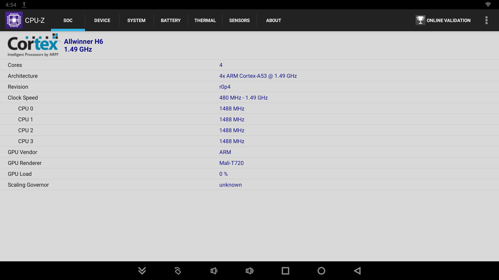
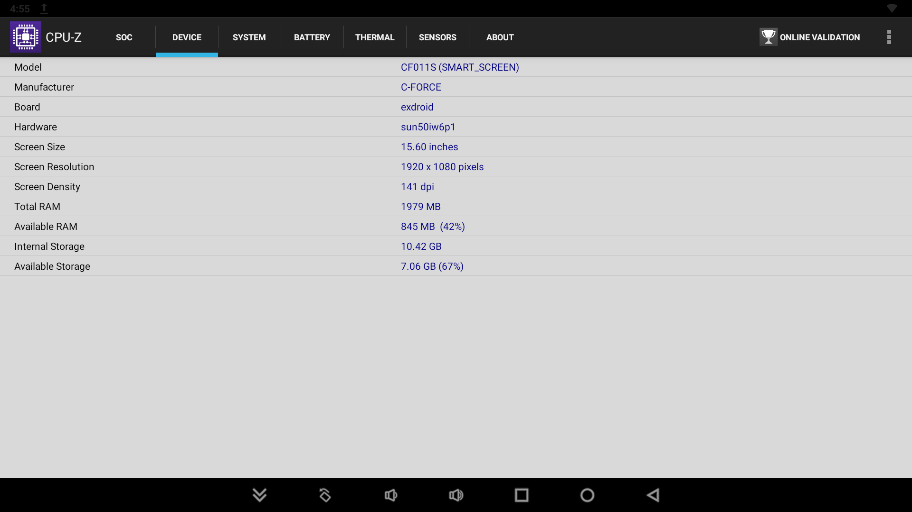
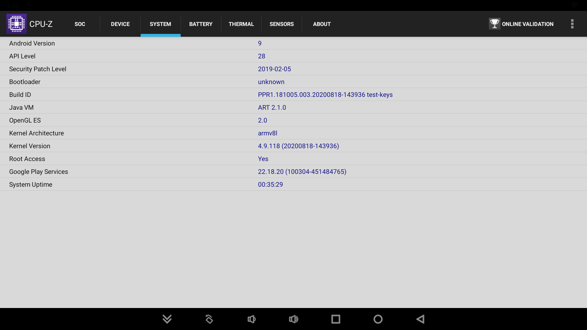

# TWRP Recovery Device Tree & Kernel
* C-Force C-SMART CF011S Smart Screen

## NOTE: Still a WIP! (Work In Progress)

## Device Specifications

| Specifications          | C-Force C-Smart CF011S Smart Screen                                 |
| ----------------------- | :-----------------------------------------------------------------: |
| Codename                | SMARTSCREEN                                                         |
| Chipset / SoC           | Sunxi(sun50iw6p1) Allwinner H6 (28 nm)                              |
| CPU                     | 4 x Cortex-A53 (Revision r0p4)                                      |
| GPU                     | Mali-T720 MP2 @ 600Mhz                                              |
| Memory                  | 2 GB DDR4                                                           |
| Shipped Android version | 9.0 (Android Pie)                                                   |
| Internal Storage        | 16GB eMMc                                                           |
| MicroSD                 | Up to 64 GB                                                         |
| USB                     | 1x USB-A, 2x USB-C (1x USB-C Reserved for Power)                    |
| Battery                 | Wall Plug                                                           |
| Dimensions              | 14.57 x 8.66 x 0.24 inches                                          |
| Display                 | 15.6 inch 1080p IPS, 1920 x 1080 pixels, 16:9 Aspect Ratio          |
| Treble Supported        | Yes                                                                 |
| VNDK Version            | 28.0                                                                |


* Key:
 * Note: /dev/block/by-name/ #Shows All By Name
  * Note 2: /dev/block/ #Shows All By Disk/Partition
   - Commands Used: df -h, fdisk -l, & blkid

| Disk / Partition         | Name                     | Type / Label / UUID / Description                                      | Android SM Disk,Partition |
| :----------------------: | :----------------------: | ---------------------------------------------------------------------- | ------ |
| mmcblk0                  | Full Firmware Image      | -                                                                      | 179,0  |                 
| mmcblk0boot0             | Boot/Bootloader          | -                                                                      | 179,16 |   
| mmcblk0boot1             | Boot/Bootloader          | -                                                                      | 179,32 |
| mmcblk0p1                | UDISK                    | UUID="6402cc8d-6982-4dbc-a560-fb1b958cf63c" TYPE="f2fs"                | 179,1  |
| mmcblk0p10               | metadata                 | -                                                                      | 179,10 |
| mmcblk0p11               | private                  | -                                                                      | 179,11 |
| mmcblk0p12               | frp                      | -                                                                      | 179,12 |
| mmcblk0p13               | empty                    | -                                                                      | 179,13 |
| mmcblk0p14               | dtbo                     | -                                                                      | 179,14 |
| mmcblk0p15               | media_data               | -                                                                      | 179,15 |
| mmcblk0p16               | Reserve0                 | SEC_TYPE="msdos" UUID="3011-07B2" TYPE="vfat"                          | 259,0  |
| mmcblk0p17               | sysrecovery              | -                                                                      | 259,1  |
| mmcblk0p18               | esm                      | -                                                                      | 259,2  |
| mmcblk0p2                | bootloader               | SEC_TYPE="msdos" LABEL="Volumn" UUID="0000-0000" TYPE="vfat"           | 179,2  |
| mmcblk0p3                | env                      | -                                                                      | 179,3  |
| mmcblk0p4                | boot                     | -                                                                      | 179,4  |
| mmcblk0p5                | system                   | LABEL="/" UUID="31ddde3b-77fc-4443-979f-8b0b8f45a142" TYPE="ext4"      | 179,5  |
| mmcblk0p6                | vendor                   | LABEL="vendor" UUID="488e68ea-d6a6-43f7-89be-5856cba59b8e" TYPE="ext4" | 179,6  |
| mmcblk0p7                | misc                     | -                                                                      | 179,7  |
| mmcblk0p8                | recovery                 | -                                                                      | 179,8  |
| mmcblk0p9                | cache                    | UUID="5743c572-037f-403f-8f08-6fef22cc77a6" TYPE="ext4"                | 179,9  |
| mmcblk1                  | Full Memory Stick        | -                                                                      | 179,48 |
| mmcblk1p1                | Mem Stick Partition      | UUID="23B8-07E9" TYPE="vfat"                                           | 179,49 |

## Treble Info:


## CPU-Z Readout:

* SoC


* Device


* System


### Additional Technical Specs (Wiki):
```
Allwinner H6 SoC Features
    CPU
        ARM Cortex-A53 Quad-Core
        512KB L2-Cache (shared between four cores)
        32 KB (Instruction) / 32KiB (Data) L1-Cache per core
        SIMD NEON, VFP4
        Virtualization
    GPU
        ARM Mali-T720 MP2
        Featuring 2 unified shader cores
        Complies with OpenGL ES 3.1, OpenCL 1.1
    Memory
        DDR3/DDR4/LPDDR2/LPDDR3 controller
        NAND Flash controller and 64-bit ECC, supports full disk encryption
        3 MMC controllers, in which MMC2 (eMMC controller) supports full disk encryption
    Video
        Ultra HD 4k and Full HD 1080p video decoding of MPEG-2, MPEG-4 SP/ASP GMC, H.263, H.264, H.265, WMV9/VC-1, and VP8
        BD Directory, BD ISO and BD m2ts video decoding
        H.264 High Profile 1080P@60fps encoding
        3840×1080,1920x2160 3D decoding
        Complies with RTSP, HTTP,HLS,RTMP,MMS streaming media protocol
    Display
        Integrated HDMI V2.0 with HDCP2.2 4K@60fps
        TV CVBS output
        RGB LCD output
    Camera
        Integrated parallel 8-bit I/F YUV422 sensor
        Support CCIR656 protocol fot NTSC and PAL
        5M CMOS sensor support
        Support video capture resolution up to 1080p@30fps
    Audio
        Two audio digital-to-analog(DAC) channels 92dB SNR
        Two differential microphone inputs (one low-noise)
        Stereo Linein input
        TDM Digital Microphone input
    Embedded Controller:
        AR100 controller.
    * Thermal Sensor Controller (TSC) providing over-temperature protection interrupt and over-temperature alarm interrupt
    - AXP805 PMIC
    - package: FBGA451, 15 mm x 15 mm, 0.65 mm Pitch
```

### Links:

[Linux Sunxi Wiki](https://linux-sunxi.org/H6)

[CForce Link](https://cforcedesign.com/collections/frontpage/products/c-smart-the-world-s-first-portable-android-touch-display)

[Amazon Link](https://www.amazon.com/CF011S-Portable-Assistant-15-6inch-Compatible/dp/B08HQRNCDV)

## Copyright

```
 /*
 *  Copyright (C) 2013-22 The TWRP
 *
 * This program is free software: you can redistribute it and/or modify
 * it under the terms of the GNU General Public License as published by
 * the Free Software Foundation, either version 3 of the License, or
 * (at your option) any later version.
 *
 * This program is distributed in the hope that it will be useful,
 * but WITHOUT ANY WARRANTY; without even the implied warranty of
 * MERCHANTABILITY or FITNESS FOR A PARTICULAR PURPOSE.  See the
 * GNU General Public License for more details.
 *
 * You should have received a copy of the GNU General Public License
 * along with this program.  If not, see <http://www.gnu.org/licenses/>.
 *
 */
 ```
